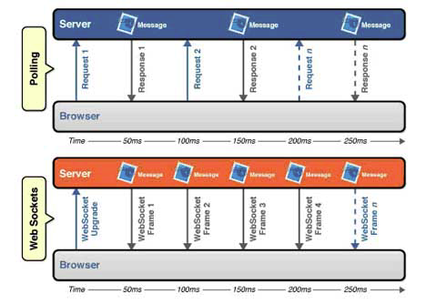
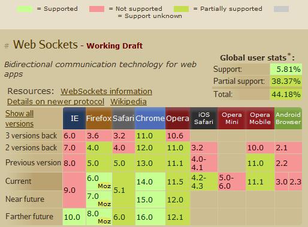

# NAVER D2 글 열람

## WebSocket과 Socket.io

### WebSocket API의 등장
https://d2.naver.com/helloworld/1336

- 기존 브라우저의 상호작용 방식 : HTTP
  - HTTP 요청 후 결과를 얻는 방식
  - 단방향 메시지 교환
- 보다 쉽게 상호작용하기 위해서는 자유로운 양방향 메시지 송수신 필요 -> Socket 통신을 이용하는 WebSocket API 등장


### WebSocket 프로토콜
- 표준 WebSocket의 API는 W3C에서 관장하고, 프로토콜은 IETF(Internet Engineering Task Force)에서 관장
- WebSocket은 다른 HTTP 요청과 마찬가지로 80번 포트를 통해 웹 서버에 연결
- HTTP 프로토콜의 버전은 1.1이지만 헤더에 Upgrade 헤더를 사용해 웹서버에 요청

```
GET /... HTTP/1.1
Upgrade: WebSocket
Connection: Upgrade
```
- WebSocket 핸드쉐이킹
  - 브라우저는 "Upgrade: WebSocket" 헤더 등과 함께 랜덤하게 생성한 키를 서버에 보냄
  - 웹 서버는 키를 바탕으로 토큰 생성 후 브라우저에 반환

- Protocol Overhead 방식으로 웹 서버와 브라우저가 데이터를 주고 받음
  - Protocol Overhead 방식 : 여러 TCP 커넥션을 생성하지 않고 하나의 80번 포트 TCP 커넥션만 이용, 별도의 헤더로 논리적인 데이터 흐름 단위를 이용

> 여기까지 봤을 때 나의 생각
> 
> 위만 봤을 때 HTTP와 완전히 다른 프로토콜인 것 같았는데 아래 내용을 보니 HTTP 프로토콜의 상위 프로토콜 개념으로 이해되는데 맞나?

### WebSocket을 지원하는 브라우저와 웹 서버

- 2011년 기준으로는 확정된 WebSocket 프로토콜은 아님 (지금은?)

### Socket.io
- JavaScript를 이용하여 브라우저 종류에 상관없이 실시간 웹을 구현할 수 있도록 한 기술
- WebSocket, FlashSocket, AJAX Long Polling, AJAX Multipart Streaming, IFrame, JSONP Polling을 하나의 API로 추상화한 것
  - 브라우저와 웹 서버의 종류와 버전을 파악하여 가장 적합한 기술을 선택하여 사용하는 방식